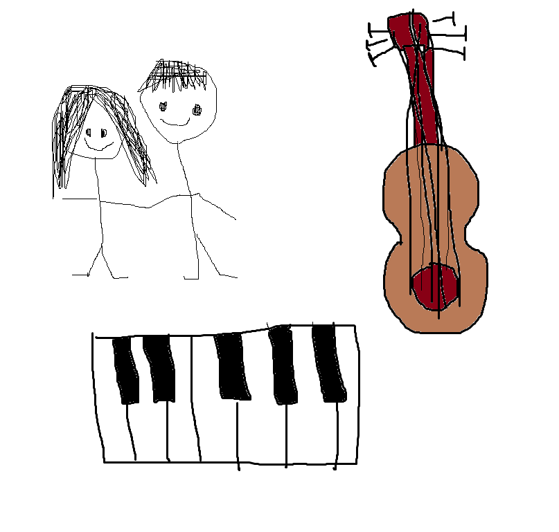

## Welcome!
## Grace Oswald's Blog.

**This is my about me picture, I drew a keyboard and a guitar, because I really like music and I enjoy playing instruments, and I drew my dad because he is my best friend and he is very important to me**

## Goals for this year
This year I hope to understand more about computers and how to code, because I don't know anything about computer science and it seems really interesting. I want to be able to understand how to solve problems that I run into and hopefully make a lot of progress

## Hacks
Asking for help is really important. My partner has explained things to me that did not make sense to me before, and now I am able to do it
Bring a charger. If your computer dies, you can't do anything
Keep trying. I have ran into problems and I just kept trying and eventually I found the right solution